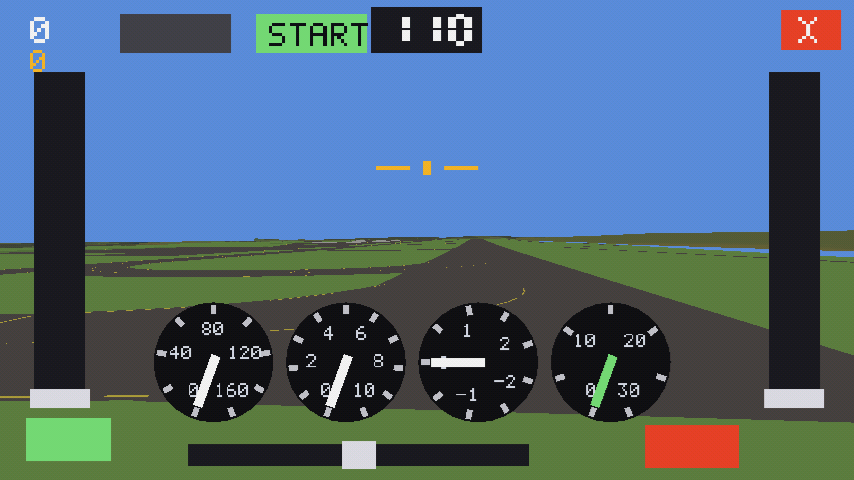

# FG Fly — ein Flugsimulator für das Nokia N9 und N950

Ein kleiner Simulator für **MeeGo Harmattan**, der mit FlightGears eigenen
Daten fliegt: Gelände aus TerraSync, Flugzeuge aus dem Hangar, Flugplätze aus
`apt.dat` — nur eben umgesetzt auf das, was eine **PowerVR SGX 530** von 2011
schafft. Kein Port von FlightGear (der scheitert an der Grafik, siehe unten),
sondern ein eigener Renderer daneben.

    sudo dpkg -i fgfly_0.3.2_armel.deb

**Was es kann** — gemessen auf einer N950:

| | |
|---|---|
| Bedienung | Neigen steuert Rollen und Nicken, Schubhebel links, Klappen rechts, Seitenruder unten, Anlasser oben |
| Flugmodell | aus JSBSim oder YASim umgerechnet, 500–1000 Bytes je Flugzeug |
| Gelände | `.btg.gz` aus TerraSync, auf dem Gerät selbst gebacken, 30–40 Bilder/s |
| Flugplätze | 23 529 Stück, nach **Land** oder Kennung zu wählen; Start auf der Bahn |
| Flugzeuge | aus dem Hangar geladen und umgesetzt — aus 271 MB werden 8 MB |
| Platz | das Paket ist 660 KB und enthält weder Szenerie noch Flugzeuge |

**Die Teile:**

| | |
|---|---|
| [`cockpit/`](cockpit/README.md) | der Simulator: Renderer, Flugmodell, Oberfläche (C, EGL/GLES2, X11) |
| [`bake/`](bake/README.md) | der Backofen: aus FlightGears Szenerie und Modellen wird ein eigenes Bündel |
| [`packaging/`](packaging/README.md) | das Debian-Paket für Harmattan |
| [`tools/`](tools/README.md) | Beiwerk (aria2 für Harmattan bauen) |
| `MESSUNG-N950.md` | was die SGX 530 wirklich kann |

Gebaut wird mit GCC 14 gegen das MADDE-Sysroot (`cockpit/build-n9.sh`,
`bake/build-n9.sh`), gepackt mit `packaging/build-deb.sh`. Das fertige Paket
hängt an jedem Release.

---

# Wie es dazu kam: FlightGear auf MeeGo — Vorprüfung der Grafik

Beantwortet eine Frage, bevor irgendetwas portiert wird: **übersetzt der
GLSL-Übersetzer des Nokia N9 die Shader, die FlightGear auf dem GLES-Pfad
wirklich benutzt?** Scheitern sie, erübrigt sich der Rest; übersetzen sie,
bleiben CPU und Arbeitsspeicher als Hürden, aber die Grafik ist keine mehr.

Die Kette:

1. `fgfs-run --backend=gles3 ... ` mit `OSG_GLES_DUMP_SHADERS=<dir>` — legt
   jeden Shader ab, den OSG dem Treiber gibt, samt Original darunter.
2. `es2ify.py <dump> <log> <corpus>` — paart Vertex und Fragment über das
   Protokoll (OSG legt die beiden Shader eines Programms nacheinander ab und
   protokolliert danach dessen Attributbindungen), schreibt jedes Paar als
   **GLSL ES 1.00** — das, was ein OpenGL-ES-2.0-Gerät übersetzen müsste — und
   stellt daneben, was das Programm vom Treiber verlangt.
3. `sgxprobe <corpus>` — übersetzt auf dem Gerät, druckt sämtliche Grenzwerte
   der Umsetzung und das Übersetzerprotokoll zu jedem Fehlschlag. Rückgabewert
   ist die Zahl der Fehler.

## Stand

**Messkette steht und ist gegengeprüft.** Der Korpus stammt aus einem Lauf auf
LOWW mit der c172p (Backend `gles3`, 20 Shader, 10 Programme); er liegt in
`corpus-es2/`, der Rohabzug in `dump-es3/`.

Gegenprobe auf dem Jolla (Mali-G610, ES 3.2) mit `sgxprobe-jolla`: **8 von 10
Programmen übersetzen und binden als ES 1.00**. Damit ist die Umschreibung
selbst geprüft — was auf dem N9 scheitert, scheitert dann am Treiber, nicht an
`es2ify.py`. Die zwei übrigen verlangen `GL_EXT_shader_texture_lod` und
`GL_EXT_frag_depth`, die Malis ES-2-Profil nicht anbietet; PowerVR bietet sie
üblicherweise an — eine der Fragen an das Gerät.

**Offen:** das `gles2`-Backend stürzte auf dem Jolla nach 51 s mit SIGSEGV ab
(Abzug deshalb aus `gles3`). Vermutlich eigen für diesen Fall — ein ES-2-Baum
auf einem ES-3.2-Kontext —, aber ungeprüft. Auf dem N9 wäre genau dieser Baum
der einzig mögliche.

**Auf dem Gerät noch nicht gelaufen.** N9 (.12), N950 (.8) und der Baurechner
(.21) waren am 22.09.2026 alle nicht erreichbar. `build-n9.sh` (auf dem
Baurechner, GCC-14-Cross gegen das MADDE-Sysroot, hartes Gleitkomma, Lader
`/lib/ld-linux.so.3` — dieselbe Kette wie die MeeGo-Ausgabe von Snapszer) und
`run-n9.sh` (kopiert Probe und Korpus aufs Gerät, startet mit `DISPLAY=:0`)
warten darauf.

## Was der Korpus schon ohne Gerät sagt

| Programm | varying | attrib | v.unif | f.unif | Sampler |
|---|---|---|---|---|---|
| p03 (Gelände, Tangente/Binormale) | **13** | 6 | 29 | 26 | **7** |
| p08 | **10** | 6 | 25 | **63** | **7** |
| p06 | **10** | 5 | 18 | 20 | 4 |
| p05 | 8 | 4 | 14 | 13 | 3 |
| p04 | 7 | 5 | 26 | 15 | 2 |
| übrige | 4–6 | 3–5 | 4–18 | 1–15 | 1–2 |

Die SGX530 meldet erfahrungsgemäß acht `varying`-Vektoren und acht
Textureinheiten; `sgxprobe` druckt die echten Werte. Trifft das zu, **binden
p03, p06 und p08 auf dem N9 nicht** — nicht wegen eines Fehlers, sondern weil das
Geländeprogramm mehr Interpolatoren verlangt, als das Gerät hat. Das sind
genau die Programme, die ein gebackener Renderer ersetzen würde.

Vier Programme benutzen `sampler3D` (ES 1.00 nur über `GL_OES_texture_3D`),
eines Ableitungen (`GL_OES_standard_derivatives`), eines ausdrückliche
Detailstufen und die Fragmenttiefe (`GL_EXT_shader_texture_lod`,
`GL_EXT_frag_depth`). `es2ify.py` schreibt die
passenden `#extension`-Zeilen; ob das Gerät sie hat, beantwortet die Probe.

## Dateien

| | |
|---|---|
| `sgxprobe.c` | die Probe; `compat/gles_min.h` nur für Rechner ohne EGL-Header |
| `es2ify.py` | Paarung, Umschreibung nach ES 1.00, Bedarfstabelle |
| `build-n9.sh` | Cross-Bau für Harmattan (auf dem Baurechner) |
| `run-n9.sh` | aufs Gerät kopieren und dort laufen lassen |
| `sgxprobe-jolla` | lokal gebaut, für die Gegenprobe |
| `corpus-es2/`, `dump-es3/`, `dump-es3.log` | Korpus, Rohabzug, Protokoll |

Lokal bauen (Jolla hat die Bibliotheken, aber keine Header):

    gcc -O1 -Wall -DSGXPROBE_MIN_HEADERS -I. -o sgxprobe-jolla sgxprobe.c \
        /usr/lib64/libEGL.so.1 /usr/lib64/libGLESv2.so.2
    EGL_PLATFORM=wayland XDG_RUNTIME_DIR=/run/display WAYLAND_DISPLAY=wayland-0 \
        ./sgxprobe-jolla corpus-es2
