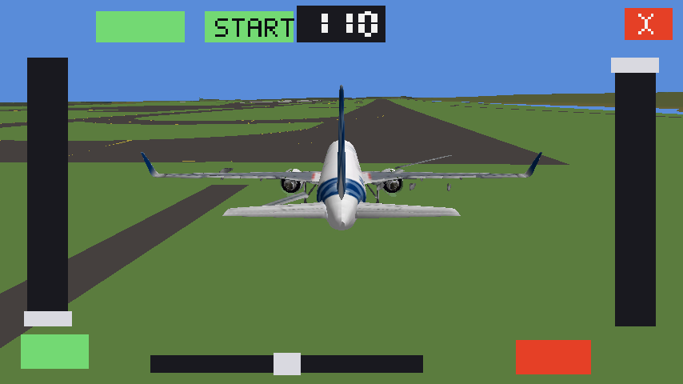
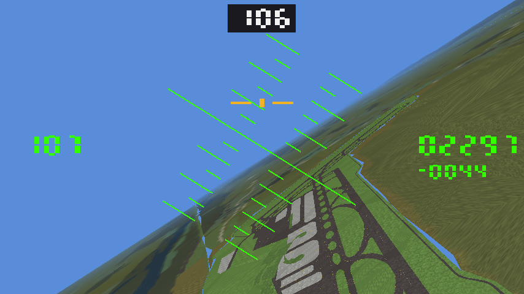
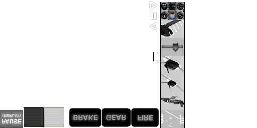

# cockpit — die Bedienung, nachgebaut

Läuft auf der N950. Nachgebaut ist, was X-Plane 9 auf derselben SGX 530 macht
([[xplane9-n950-apkenv]]): neigen steuert Rollen und Nicken, links der
senkrechte Schubhebel, rechts die Klappen, unten die Bremse, oben links der
Ansichtsknopf. Dazu ein Horizont, damit die Lage sichtbar ist.

    build-n9.sh                       auf dem Baurechner bauen
    DISPLAY=:0 ./cockpit [sekunden]   auf dem Gerät starten

## Gemessen auf der N950, 22.09.2026

    PowerVR SGX 530, 854x480
    Shader: 137 + 63 = 200 Bytes
    648 Bilder in 12,0 s = 54,0 Bilder/s, 54 Eckpunkte je Bild

**54 Bilder je Sekunde** bei eingeschalteter Bildsynchronisation, auf einem
Gerät, das nebenher noch anderes tut. Der Beschleunigungssensor
(`/sys/devices/platform/lis3lv02d/position`) wird je Bild gelesen und liefert
die Rollen- und Nickwinkel; im Lauf oben lag das Gerät um 19 Grad gekippt.

Das Bild dazu: `cockpit.png` (mit `COCKPIT_SHOT=` aus `glReadPixels`).

## Warum das 200 Bytes reichen

Beide Shader zusammen:

    attribute vec2 a_pos;  attribute vec4 a_col;  varying lowp vec4 v_col;
    void main() { v_col = a_col; gl_Position = vec4(a_pos, 0.0, 1.0); }

    varying lowp vec4 v_col;
    void main() { gl_FragColor = v_col; }

Ein varying, kein Sampler, keine Matrix. Die Geometrie — Horizont, zwei
Schieber, zwei Knöpfe — entsteht je Bild auf der CPU als 54 Eckpunkte und geht
in **einem** `glDrawArrays` an die GPU. Zum Vergleich: FlightGears
Geländeprogramm verlangt 13 varying, die SGX 530 hat 8.

## Umgebung

| | |
|---|---|
| `COCKPIT_SHOT=<datei>` | legt ein Bild als PPM ab |
| `COCKPIT_SHOT_FRAME=N` | welches Bild (Vorgabe 60) |
| `COCKPIT_AXES=r,p` | welche Sensorachsen Rollen und Nicken geben, mit Vorzeichen |
| `COCKPIT_NOSENSOR=1` | ohne Sensor laufen |
| `COCKPIT_EDGE=px` | wie breit der Rand ist, der dem Randwisch gehört (Vorgabe 12, `0` schaltet ab) |
| `COCKPIT_ANGLE=grad` | `_MEEGOTOUCH_ORIENTATION_ANGLE` (Vorgabe 0, also quer) |
| `COCKPIT_TOUCH=/dev/input/eventN` | diesen Berührungsschirm lesen statt zu suchen (Prüfen über ssh, siehe `mtap.py`) |
| `COCKPIT_ICAO=LOWW` | um welchen Platz die Kacheln geladen werden (nur mit `COCKPIT_TERRAIN`) |

## Zwei Fallen, die Zeit gekostet haben

* **Der Sichttyp muss zur EGL-Konfiguration passen.** Erst die Konfiguration
  wählen, `EGL_NATIVE_VISUAL_ID` abfragen, das X-Fenster mit *diesem* Sichttyp
  und einer eigenen Farbtafel anlegen — sonst weist
  `eglCreateWindowSurface` die Fläche ab, und `eglGetError` meldet dabei
  seelenruhig `EGL_SUCCESS`.
* **Pbuffer gibt es für ES2 nicht** (siehe `../MESSUNG-N950.md`). Fenster und
  Pixmap ja, Pbuffer nein.

## Flugmodell und Instrumente (22.09.2026)

`fdm.c` fliegt, `acftconv.py` liefert das Flugzeug dazu. Vier runde
Instrumente — Fahrt, Höhe, Variometer, Drehzahl — stehen unter dem Horizont,
der zugleich der Fluglageanzeiger ist (`cockpit-c172.png`).

**Das Flugzeug kommt aus FlightGears eigenen Daten.** `acftconv.py` liest die
JSBSim-Datei eines Hangar-Flugzeugs und schreibt daraus **1041 Bytes**:

    name c172
    mass_kg 747.1      wing_area_m2 16.165      thrust_max_n 2400
    cl_alpha 22 -5.1566 -0.2200 0.0000 0.2500 5.1566 0.7300 ...
    cd_alpha 28 ...    cl_flap 4 ...    cd_flap 4 ...

Also die echte Auftriebs- und Widerstandskurve über dem Anstellwinkel, der
Abriss inbegriffen (die Tabelle fällt über 16 Grad von selbst), der
Klappenbeitrag und die Motorleistung aus `Engines/eng_io320.xml`. Aus 168 MB
Hangar wird ein Kilobyte.

Gemessener Start auf der N950 mit genau dieser Datei: abheben bei 62 kt,
steigen mit 600 ft/min bei 70 kt und 8 Grad — eine echte C172 macht rund
700 ft/min bei 74 kt.

    COCKPIT_ACFT=/home/user/c172p.fdm ./cockpit
    COCKPIT_DEMO=1                     Start ohne Hand am Gerät

## YASim-Flugzeuge

Die Hälfte des Hangars benutzt nicht JSBSim, sondern **YASim** — darunter die
Long-EZ. YASim beschreibt das Flugzeug geometrisch und löst die Beiwerte beim
Start selbst; das können wir nicht. Also rechnet `acftconv.py` sie einmal aus,
und zwar aus den **zwei Punkten, die in der Datei stehen**:

* der **Anflug** (`<approach speed="65" aoa="4">`) — dort trägt der Auftrieb
  genau das Gewicht, daraus fällt der Auftriebsbeiwert bei diesem Winkel;
* der **Reiseflug** (`<cruise speed="125">` mit `cruise-power="46"`) — dort
  deckt der Schub den Widerstand, daraus fällt der Nullwiderstand, wenn man
  den induzierten abzieht.

Dazwischen der Anstieg aus der Streckung (Traglinie) und der Abriss aus
`<stall aoa="18">`. Kein YASim, aber aus den Zahlen des Flugzeugs.

    long-ez-yasim (YASim) -> long-ez.fdm (855 Bytes)
      Masse 617 kg, Flaeche 11.2 m2, Streckung 6.5, 115 PS
      Anflug 65 kt bei 4 Grad -> cl 0.79; Reise 125 kt, 46 PS -> cd0 0.0150
      Abriss bei 18 Grad

Aus 17 MB Hangar-Paket werden **855 Bytes Flugmodell, 242 KB Modell und
2 MB Bild** (`long-ez.png`).

## Gebackenes Gelände (22.09.2026)

`terrain.c` lädt ein `.fgb`-Bündel aus `../bake/` und zeichnet es. Beim Laden
werden die erdfesten Eckpunkte **einmal** ins örtliche System gedreht (Ost,
Nord, oben) — danach ist die Kamera gewöhnliche Rechnerei und der Shader weiß
nichts davon. Der Gelände-Shader ist **357 Bytes**, ein `varying`, keine
Textur: Farbe je Material, Helligkeit aus der Normalen.

Oben in der Mitte steht die Kompassrichtung als dreistellige Zahl —
Sieben-Segment-Ziffern aus denselben Rechtecken wie alles andere, sieben je
Ziffer (`kompass.png`).

Gemessen auf der N950, 600 m über dem Wiener Becken, 100 kt:

| Kachel | Dreiecke | Bilder/s |
|---|---|---|
| `3220096` (v7) | 97 416 | **30,8** |
| `3220105` (v10) | 378 278 | **15,9** |

Aus den beiden Punkten folgt eine Gerade aus festem Aufwand und Dreiecken je
Sekunde; was den festen Teil ausmacht, steht unten — gemessen, nicht geraten.

`terrain-loww.png` zeigt, wie es aussieht: Felder, Wald, Straßen und ein Fluss
im Wiener Becken, die Zifferblätter darüber.

    COCKPIT_TERRAIN=/home/user/loww.fgb COCKPIT_ALT=600 COCKPIT_SPEED=100 ./cockpit
    COCKPIT_VSYNC=0                    Bildsynchronisation aus (der Treiber
                                       hält sich nicht daran, siehe unten)
    COCKPIT_NO2D=1                     Bedienoberfläche weglassen (Messung)
    COCKPIT_VIEWPORT=0.5               nur ein Viertel der Fläche (Messung)
    COCKPIT_HDG=285                    Kurs beim Start

## Wo die Zeit hingeht (aufgeschlüsselt, 22.09.2026)

Fünf Läufe, je 8 s, gleiche Szene, nur ein Schalter anders:

| | Bilder/s | ms |
|---|---|---|
| leer (nur löschen und tauschen) | 56,1 | **17,8** |
| nur Bedienoberfläche, kein Gelände | 53,3 | 18,8 |
| Gelände, ohne Bedienoberfläche | 31,8 | 31,4 |
| Gelände + Bedienoberfläche | 32,5 | 30,8 |
| dasselbe, **Viertel der Bildfläche** | 32,4 | 30,9 |

Drei Dinge folgen daraus, und zwei davon sind gute Nachrichten:

* **Füllrate ist es nicht.** Ein Viertel der Pixel kostet dieselbe Zeit. (Auf
  dem Jolla war es genauso — BEFUNDE P2.)
* **Die Bedienoberfläche ist umsonst.** 738 Eckpunkte über Client-Arrays
  kosten etwa eine Millisekunde, im Rauschen der Messung.
* **17,8 ms gehen für das leere Bild drauf** — löschen und tauschen, sonst
  nichts. Das sind 56 Bilder/s als Obergrenze, und `eglSwapInterval(0)` ändert
  nichts daran: der Treiber taktet den Bildtausch mit der Anzeige, ob man will
  oder nicht. Dieser Posten ist nicht zu optimieren, er ist der Bildschirm.

Bleibt für das Gelände: **13 ms für 97 416 Dreiecke = 7,5 Millionen Dreiecke
je Sekunde.** Und daraus das Budget, an dem sich das Ausdünnen messen lassen
muss:

> Für 30 Bilder/s bleiben 33,3 − 17,8 = **15,5 ms, also rund 115 000 Dreiecke
> je Bild.**

Die 250 000 Dreiecke, die bei brauchbarer Sicht im Bild lägen, wären damit
20 Bilder/s — eine Halbierung genügt, keine Zehntelung.

## Mehrere Kacheln (22.09.2026)

`COCKPIT_TERRAIN` darf jetzt ein Verzeichnis sein. Alle Bündel darin werden
geladen, **die erste Kachel legt das örtliche System fest**, jede weitere wird
beim Laden in dasselbe gedreht und um den Abstand der Mittelpunkte versetzt —
dadurch fällt die Erde am Rand richtig weg (über 16 km sind das 20 m). Der
Shader bleibt einer für alle, und gezeichnet wird nur, was näher als die
Sichtweite und nicht hinter der Kamera liegt.

Neun Kacheln um LOWW, zusammen 1 040 575 Dreiecke, 900 m über Grund:

| Sichtweite | Kacheln | Dreiecke | Bilder/s |
|---|---|---|---|
| 6 km | 2 | 186 516 | **23,5** |
| 10 km | 3 | 315 894 | 17,3 |
| 14 km | 4 | 694 172 | 10,5 |
| 20 km | 5 | 785 921 | 9,5 |
| 25 km | 6 | 948 937 | 8,2 |

Das passt auf die Millisekunde zur Geraden von oben (17,8 ms + Dreiecke ÷
7,5 Mio./s) — die Vorhersage stimmt, und damit auch der Schluss:

**Ausdünnen ist jetzt nicht mehr Feinschliff, sondern Voraussetzung.** Eine
Kachel ist 16 km breit; unter zwei Kacheln kommt man durch Auswählen nicht,
also nie unter ~190 000 Dreiecke, und das sind 23 Bilder/s bei einer Sicht,
die kaum über die eigene Kachel hinausreicht. Was fehlt, ist eine *zweite,
ausgedünnte Fassung je Kachel* für die Ferne — und die gehört in den Backofen,
nicht in den Renderer. Zielmarke: die entfernten Kacheln auf ein Achtel, dann
liegen vier Kacheln bei rund 150 000 Dreiecken und damit bei 25 Bildern/s.

`mehrere-kacheln.png` zeigt, wie es aussieht: vier Kacheln, die Stadt am
Horizont, 1200 m über Grund.

    COCKPIT_TERRAIN=/home/user/kacheln   Verzeichnis voller .fgb
    COCKPIT_RANGE=14000                  Sichtweite in Metern

## Mit ausgedünnten Kacheln in der Ferne

Liegt neben `X.fgb` ein `X.lod.fgb`, nimmt der Renderer es für alles, was
weiter weg ist als `COCKPIT_LOD` (Vorgabe 8 km). Dieselben neun Kacheln,
dieselbe Stelle, 25 km Sicht:

| | Dreiecke | Bilder/s |
|---|---|---|
| nur feine Kacheln | 948 937 | 8,2 |
| **feine nah, grobe fern (200-m-Zelle)** | **147 365** | **21–26** |

Sechs Kacheln im Bild, fünf davon grob. Dreimal so schnell bei gleicher Sicht,
und im Bild (`lod.png`) sieht man den Unterschied nicht: die Kachel unter einem
behält alle Dreiecke, die Stadt am Horizont braucht keine.

## Mit dem gebackenen Bild (22.09.2026)

Liegt neben `X.fgb` ein `X.tex`, nimmt der Renderer es als Bild der Kachel.
**Die Texturkoordinate kommt aus dem Ort** — das Bild liegt flach über der
Kachel, also braucht kein Eckpunkt sie mitzuschleppen: der Vertexshader
rechnet sie aus `a_pos.xy` und einem `vec3`-Uniform. Das Eckpunktformat bleibt
damit bei 16 Bytes, und die grobe Fassung teilt sich das Bild mit der feinen.

`u_col` ist weiß, wenn die Kachel ein Bild hat, und sonst die Materialfarbe;
Kacheln ohne Bild bekommen eine weiße Textur von einem Punkt. So bleibt es
**ein** Programm ohne Verzweigung im Fragment — 483 Bytes, zwei `varying`.

Gemessen, dieselben neun Kacheln, 25 km Sicht: **21 Bilder/s** — also
unverändert. Das Bild kostet nichts, was zur früheren Messung passt, dass die
Füllrate hier nicht der Engpass ist. Dafür ist ein Zeichenaufruf je Kachel
daraus geworden statt siebzehn.

`textur.png` zeigt es: weiche, gemischte Landschaft statt flacher Farbflächen,
die Stadt am Horizont.

### Feineres Bild, Verkleinerungsstufen, Körnung

Drei Schritte danach, alle drei ohne Kosten in der Bildrate (21–23 Bilder/s,
unverändert):

* **1024 statt 512** für die feine Kachel, 512 für die grobe (`<name>.lod.tex`).
  18 m je Bildpunkt, 2 MB je Kachel.
* **Verkleinerungsstufen** (`glGenerateMipmap`, `LINEAR_MIPMAP_LINEAR`). Ohne
  sie wird der Boden im flachen Blick zu Brei — ein Bildpunkt deckt dort
  Dutzende der Textur ab. Anisotropes Filtern hat die SGX 530 nicht.
* **Eine Körnung**, die sich alle 60 m wiederholt, aus einer Zahlenfolge
  erzeugt statt aus einer Datei (64 × 64, Helligkeit).

Dabei die Falle des Tages: `v_grain = a_pos.xy * u_detail` liefert **nichts**.
Der Ort geht bis 11 000 m, und ein `mediump`-`varying` hat zehn Bit Mantisse —
davon bleibt keine Nachkommastelle übrig, und die Texturkoordinate ist konstant.
Es muss vorher zurückgefaltet werden:

    v_grain = fract(a_pos.xy * u_detail) * 10.0;      // u_detail = 1/600

Zehn Wiederholungen je 600 m gehen an der Naht glatt auf, und der Wert bleibt
unter zehn.

**Ehrlich zum Ergebnis:** die Körnung ist drin und kostet nichts, aber sie
rettet den Nahbereich nicht. Ein Landbedeckungsbild hat unterhalb von 18 m
schlicht keine Auskunft. Wer den Boden aus 200 m scharf will, braucht
FlightGears eigene, sich wiederholende Materialtexturen als zweite Lage — und
genau dafür hat X-Planes `terrain.glsl` zwei Sampler.

## Wie die anderen Apps: Randwisch, Aufgabenansicht, Schließen (23.09.2026)

Bis hierher legte `cockpit` sein Fenster mit `override_redirect` an — am
Fenstermanager vorbei. Das ist der kürzeste Weg zu einem Vollbild, hat aber
den Preis, dass Harmattans **Randwisch** nicht wirkt: die Geste gehört dem
Compositor, und der sieht ein Fenster, das an ihm vorbei entsteht, überhaupt
nicht. Die App ließ sich nur über die Tastatur oder von außen beenden.

Jetzt ist es ein gewöhnliches, verwaltetes Fenster, das sich den Schirm über
`_NET_WM_STATE_FULLSCREEN` nimmt. Dazu gehört:

| | |
|---|---|
| `_NET_WM_WINDOW_TYPE_NORMAL`, `_NET_WM_STATE_FULLSCREEN` | **vor** dem Abbilden gesetzt — der Compositor liest sie bei der Abbildungsanfrage, später nicht mehr |
| `WM_PROTOCOLS` = `WM_DELETE_WINDOW` | sonst schneidet das Schließen die Verbindung ab (`XKillClient`), statt uns aufräumen zu lassen. `_NET_WM_PING` sagen wir **nicht** zu: der Compositor fragte sonst laufend nach, und beim Laden einer Szenerie hielte er uns für hängend |
| `WM_CLASS` = `cockpit` | die `.desktop`-Datei nennt `X-Maemo-Wm-Class=cockpit`; ohne die Eigenschaft am Fenster findet der Starter es nicht wieder |
| `_NET_WM_PID`, `WM_CLIENT_MACHINE` | damit der Compositor weiß, wen er vor sich hat |
| `_MEEGOTOUCH_ORIENTATION_ANGLE` = 0 | wir liegen quer wie die Wurzel selbst |
| `WM_NAME` = `FG Fly` | das steht in der Aufgabenansicht |

**Zwei Dinge, die daran hängen und leicht übersehen werden:**

* **Der Berührungsschirm kennt keinen Fokus.** Wir lesen `/dev/input/event*`
  selbst; weggewischt meldet er weiter jeden Finger, der auf dem
  Startbildschirm landet. Also: auf `VisibilityNotify`
  (`VisibilityFullyObscured`, das schickt der Compositor eigens) und
  `UnmapNotify` hin nichts mehr rechnen und nichts mehr zeichnen — der Schirm
  wird nur noch leergelesen und verworfen, das Flugmodell steht, die Schleife
  schläft in 100-ms-Schritten. Beim Zurückkommen fängt der Zeitschritt neu an,
  sonst wäre der erste `dt` die ganze Abwesenheit.
* **Den Wisch sehen wir mit.** Derselbe Finger, den der Compositor als Geste
  liest, kommt bei uns über evdev an — und er setzt dort auf, wo der
  Schubhebel liegt. Ein Finger, der in den äußersten 12 Bildpunkten aufsetzt,
  gilt deshalb als nicht unserer (`COCKPIT_EDGE`).

**Teilweise nachgemessen** (23.09.2026, N950): das Fenster steht im Vollbild
auf dem Schirm, es beendet sich sauber, und nach dem Ende ist wieder der
Startbildschirm da. **Der Wisch selbst ist weiter ungeprüft** — dazu müsste
jemand mit der Hand wischen. Dabei herausgekommen ist auch, dass ein solches
Fenster **keine X-Zeigerereignisse** bekommt und dass der Compositor kein
`VisibilityNotify` schickt (beides steht unten). Auf der N950 zu prüfen:

1. **Der Wisch von oben nach unten beendet sie** (Einstellungen → Gerät →
   Anzeige → *Nach unten wischen zum Schließen*): der Compositor schickt
   `WM_DELETE_WINDOW`, die Schleife läuft auf ihr Ende zu. Das prüft
   nebenbei `_MEEGOTOUCH_ORIENTATION_ANGLE` mit — stünde der Winkel falsch,
   käme „oben“ von einer der kurzen Kanten, also von links oder rechts im
   Bild.
2. Der Wisch zur Seite legt sie in die Aufgabenansicht, statt sie zu übergehen.
3. Dort steht sie als *FG Fly* mit unserem Zeichen, und das Kreuz beendet sie
   ebenso sauber (die Bilder-je-Sekunde-Zeile am Ende kommt noch, der
   Szenerie-Holer wird mitgenommen).
4. Die Bildrate bleibt bei 54 — der Compositor sollte ein deckendes
   Vollbildfenster weiterhin direkt durchreichen. Fällt sie, ist
   `_NET_WM_STATE_FULLSCREEN` der erste Verdächtige.
5. Auf dem Startbildschirm bewegt sich nichts mehr von uns aus (kein Schub,
   der sich verstellt, während die App in der Aufgabenansicht liegt).

## Zweite Runde am Gerät (23.09.2026)

Vier Meldungen von Sebastian nach dem Fliegen, und dahinter drei Ursachen —
zwei davon dieselbe.

**Der Motor lief nicht, und die Außensicht ließ sich nicht wählen: ein und
derselbe Fehler.** `touch()` wird aufgerufen, solange der Finger liegt, also
in **jedem Bild**. Die Schieber (Schub, Klappen, Seitenruder) wollen das; die
Schalter nicht: `brake = !brake` sprang dreißigmal in der Sekunde um, und was
beim Abheben des Fingers herauskam, war Zufall. Dasselbe für das Fahrwerk und
für die Ansicht (`view_mode = (view_mode + 1) % 3` — bei drei Zuständen und
dreißig Umläufen kommt nie der heraus, den man wollte).

Und die Bremse entscheidet hier alles: `0,35 · 9,81 · 747 kg ≈ 2565 N`
Bremskraft gegen **2400 N** Standschub — mit angezogener Bremse kommt eine
C172 bei vollem Schub keinen Meter weit. Der Motor lief also, nur ließ er sich
nicht lösen.

`touch()` bekommt jetzt mit, ob der Finger gerade aufgesetzt hat
(`touch_prev.n == 0`, beim X-Zeiger `ButtonPress`), und die Schalter — Bremse,
Fahrwerk, Ansicht, das Kreuz — reagieren nur darauf. Die Schieber folgen
weiter jedem Bild.

**Der Asphalt der Bahn war nicht zu sehen**, weil eine Kachel mit Bild in
*einem* Aufruf gezeichnet wird und die Materialgruppen dann gar nicht mehr
vorkommen — und im gebackenen Bild ist die Bahn Wiese, weil `pa_taxiway` in
`materials.txt` fehlte. Die Flugplatzkachel bekommt ihr Bild jetzt wieder
weggenommen (`terrain_drop_texture`) und wird nach Material gezeichnet: 21 636
Dreiecke in 31 Gruppen kosten wenig, und die Bahnkante ist scharf statt fünf
Meter je Bildpunkt verwischt. `material_colour` kennt dazu die Familien
`pa_` (Asphalt), `pc_` (Beton) und `lf_` (Markierung, nach ihrer Farbe).
Die Farbtafel des Backofens hat die Beläge ebenfalls bekommen — siehe
`../bake/README.md`; neu backen muss man deswegen nichts.

**Dabei aufgefallen:** `start_on_runway` las die Bahnrichtung aus der
**fünften** Spalte — dort steht die Art des Platzes. Wer ohne Auswahl auf einer
Flugplatzkachel anfing (`COCKPIT_TERRAIN`, `COCKPIT_AUTOSTART`), stand deshalb
quer zur Bahn und schaute nach 1 Grad. Jetzt liest dieselbe Funktion die Zeile
mit `parse_airport` wie alle anderen auch.

**Flugplätze nach Land.** Die Kennung zu raten war die einzige Art, einen Platz
zu finden. `airports.txt` hat jetzt eine Länderspalte (`../bake/aptcountry.py`,
alle 23 529 Zeilen), und die Buchstabenseite hat oben rechts einen Umschalter:

    WOHIN -> GROSSFLUGHAFEN -> [NACH LAND] -> O -> OESTERREICH -> LOWW -> Bahn

Nach Land ist die Vorgabe. Der Buchstabe ist dann der des Landes, die neue
Seite dazwischen zeigt die Länder mit diesem Anfangsbuchstaben, die überhaupt
Plätze dieser Art haben (sieben je Seite, blättern wie in der Platzliste).
`NACH KENNUNG` schaltet auf den alten Weg zurück. Die Länder heißen deutsch
und in Großbuchstaben ohne Umlaute, weil die 5×7-Schrift nur ASCII kennt.

**Nachtrag:** inzwischen am Gerät nachgemessen — siehe den nächsten
Abschnitt. Zu prüfen war:

1. Ein Tipp auf die Bremse löst sie und sie bleibt gelöst; mit Schub rollt das
   Flugzeug an.
2. Ein Tipp auf den Ansichtsknopf schaltet **eine** Ansicht weiter; in der
   Verfolgersicht dreht ein Finger in der Bildmitte um das Flugzeug.
3. Auf LOWW liegt unter dem Flugzeug grauer Asphalt mit den aufgemalten Linien
   darauf, und die Bahn zeigt dorthin, wo die Nase hinzeigt.
4. GROSSFLUGHAFEN → NACH LAND → O → OESTERREICH führt zu LOWW.

## Dritte Runde, diesmal am Gerät gemessen (23.09.2026)

Der Baurechner war über den `arch`-Tunnel erreichbar und die N950 von dort aus
im LAN — also **gebaut, aufgespielt und wirklich geflogen**, statt wieder nur
übersetzt. Drei Sachen kamen dazu, drei Fehler dabei heraus.

**Der Anlasser.** Am Boden fängt der Motor jetzt **stehend** an, oben in der
Reihe steht ein grüner Knopf `START` (läuft er, ist der Knopf dunkel und heißt
`STOP`). Ohne Motor bewirkt der Schubhebel nichts und die Drehzahl steht auf
null — das ist auch zu sehen, statt dass man rätselt. `fdm_state` hat dafür
`engine_on`; in der Luft fängt man mit laufendem Motor an.

**Gemessen, Zeile für Zeile aus dem Protokoll** (ein virtueller
Berührungsschirm tippt, siehe unten):

    25,2 s  tap 311 34     START   ->  Drehzahl 0 -> 700 U/min
    31,1 s  tap 691 445    Bremse  ->  Bremse 1 -> 0, und sie bleibt 0
    37,1 s  tap 68 144     Schub   ->  0,79 ... und dann:
            1,0 kt -> 5,6 -> 10,0 -> 14,2 -> ... -> 54,0 kt

Das Flugzeug rollt. Vorher sprang die Bremse dreißigmal in der Sekunde um und
hielt mit 2565 N gegen 2400 N Schub alles fest — das war der „Motor läuft
nicht“.

**Der Asphalt ist da** (`bahn-asphalt.png`, aus dem Bildspeicher des Geräts,
nicht aus unserem eigenen Puffer): graue Bahn, gelbe Linien darauf, und der
Kompass zeigt 110 — die Bahnrichtung stimmt also auch.

**Drei Fehler, die erst der Lauf zeigte:**

* **`COCKPIT_TERRAIN` zeigte überhaupt kein Gelände.** `have_terrain` wird nur
  in `load_world` gesetzt; über die Umgebungsvariable wurden die Kacheln
  geladen und dann nicht gezeichnet (`0 Kacheln, 0 Dreiecke`), und das
  Flugzeug stand auf Meereshöhe unter der Landschaft. Der Zweig macht jetzt
  dasselbe wie das Menü.
* **Das Menü lud die Kacheln um den falschen Platz.** `load_terrain_dir` nahm
  den Flugplatz, der der *Mitte des Gebiets* am nächsten liegt — bei zwanzig
  gebackenen Plätzen selten der gewählte. Man stand dann an den Koordinaten
  seines Platzes, aber ohne Boden darunter. Die Funktion nimmt jetzt die
  Kennung, die gewählt wurde (`COCKPIT_ICAO` zum Prüfen).
* **Weggewischt lief die App weiter.** Der Compositor schickt hier **kein**
  `VisibilityNotify`, wenn eine andere App in den Vordergrund kommt — 44
  Bilder je Sekunde im Hintergrund. Jetzt zählt zusätzlich der **Fokus**
  (`FocusOut`), aber erst, nachdem wir ihn einmal hatten: eine App, die nie
  einen bekommt, soll sich nicht selbst anhalten.

**Und ein Befund zum Prüfen über ssh:** ein Vollbildfenster unter mcompositor
bekommt **keine X-Zeigerereignisse** — `tap.py` (virtueller Zeiger) bedient
zwar die Systemoberfläche, aber nicht uns. Deshalb liest `cockpit` auf Wunsch
einen bestimmten Berührungsschirm:

    COCKPIT_TOUCH=/dev/input/event8 ./cockpit

Dazu gehört `~/ps/meego-uitest/mtap.py`: ein virtuelles Multitouch-Gerät
(Protokoll A, dieselben Achsen wie der echte Schirm), **ohne** `BTN_TOUCH` —
dann macht X keinen Zeiger daraus und tippt nicht in der Oberfläche des
Nutzers mit.

    mtap.py 25:tap:0.365:0.07 31:tap:0.81:0.93 37:tap:0.08:0.30

**Paket 0.3.0** (`../build/fgfly_0.3.0_armel.deb`, 658 KB, 15 Dateien) ist auf
der N950 **installiert** (`dpkg -l fgfly` -> `ii 0.3.0`).

**Flugzeuge herunterladen geht** (23.09.2026 geprüft, über WLAN): die
AG-14 aus FlightGears Hangar, 1 MB Paket, mit `fgfly-aircraft.sh` geholt,
ausgepackt und umgesetzt — heraus kommen **833 Bytes Flugmodell** (YASim,
529 kg, 17,6 m², 99 PS, Abriss bei 18 Grad) und **271 KB Modell** mit sechs
Bildern, das Hangar-Paket wird danach gelöscht. Einzige Auffälligkeit: die
größte Texturgruppe (`blue-grey.png`, 11 625 der 13 494 Dreiecke) hat **keine**
`.tex`-Datei bekommen — das Bild fehlt offenbar im Hangar-Paket, der Rumpf
bleibt einfarbig. Das ist das Nächste, was man sich ansehen sollte.
**Gebaut gehört es hier, nicht auf dem Baurechner:** `build-deb.sh` holt
`fgfs-scenery` aus `$HOME/fgfs-work` mit `|| true`, und den Baum gibt es nur
hier — auf arch kam das Paket stillschweigend **ohne** den Lader heraus (14
statt 15 Dateien), und dpkg hätte ihn beim Installieren gelöscht. Also die
ARM-Programme von arch holen und das Paket hier schnüren.

## Flugzeuge aus dem Hangar, und was daran falsch war (23.09.2026)

Sebastian hat sich in der Liste vertippt und damit **258 MB** angestoßen; das
Flugzeug, das dabei herauskam, war dann in der Außenansicht nicht zu sehen.
Beides waren Fehler, keine Bedienfehler.

**Erst fragen, dann laden.** Ein Tipp in der Hangarliste hat sofort geladen —
bei sieben Zeilen übereinander trifft man leicht die falsche. Jetzt kommt eine
Seite dazwischen: Name, Kennung, **Größe in MB**, und zwei große Knöpfe
(`ZURÜCK` / `LADEN`; steht das Flugzeug schon da, heißt der rechte `NEHMEN`).
Die Warteseite hat jetzt einen Knopf `ABBRECHEN` — er schießt die **ganze
Prozessgruppe** ab (`setpgid` im Kind, `kill(-pid)`; sonst lädt das Python im
Skript munter weiter), und das Skript räumt in seinem `trap` das halbe Paket
weg. Auf das Aufräumen wird **nicht gewartet** (`WNOHANG`): ein `rm -rf` über
ein ausgepacktes 258-MB-Paket auf vfat dauert lange genug, dass das Bild
stillstünde — ausgerechnet nachdem man auf Abbrechen gedrückt hat. Und zwischen zwei
Listenzeilen liegt ein schmaler toter Streifen: wer die Kante trifft, trifft
lieber nichts als die Nachbarzeile.

**Warum der A320 unsichtbar war.** Das Skript nahm die erste `*-set.xml` im
Paket und die erste `.ac` in `Models/`. Bei `A320-family` sind das fünf
Spielarten und `Models/empty.ac` — der Platzhalter der Bemalungsverwaltung,
**null Dreiecke**. Das Flugmodell kam aus der falschen Spielart und bestand aus
lauter Vorgabewerten (680 kg, 16 m²), weil JSBSim seine Teile ausgelagert hat
(`<metrics file="Systems/a320-metrics"/>`) und der Umsetzer den Verweisen nicht
folgte.

Jetzt geht beides über die `-set.xml` **der gewählten Spielart**:

| | |
|---|---|
| `sim/aero` | welche Flugmodelldatei gilt (`A320neo-PW.xml`, nicht `A320-100-CFM.xml`) |
| `sim/model/path` | welches Modell — und das ist ein **Baum** aus XML-Dateien |
| `<metrics file="…"/>` | JSBSim lädt Teile nach; `acftconv.py` tut das jetzt auch |

**Ein Verkehrsflugzeug wird aus Teilen zusammengesetzt.** `acbake.py` folgt dem
Modellbaum und backt alle Außenteile in **ein** Bündel; Innenraum, Cockpit,
Instrumente, Lichter und Bodengerät bleiben weg. Die Lage steht als
`<offsets>` in Metern daneben — in der XML heißt x nach hinten, y nach rechts,
z nach oben, in der `.ac` sind dieselben Achsen x, z, y.

    A320neo-PW-set.xml: 16 Teile
        fuselage.ac   x-18.85  a320.wings.ac  x -3.57   PW_PurePower_1100G.ac (2x)
        a320.nlg.ac   a320.mlg.left/right.ac  sharklets  hstab.ac  vstab.ac
    -> 38 431 Eckpunkte, 67 018 Dreiecke, 7 Texturgruppen, 1294 KB

Nachgemessen am fertigen Bündel: **35,2 m Spannweite, 37,6 m Länge, 12,4 m
hoch** — ein A320neo ist 35,8 × 37,6 × 11,8 m. Die Teile sitzen also richtig.

**Das Flugmodell dazu:** 50 t, 122,6 m² (der echte Wert), **241 kN Schub** aus
zwei `<milthrust>`-Angaben (die Hilfsturbine im Heck zählt nicht mit), und die
Auftriebs- und Widerstandskurven heben jetzt auch bei Verkehrsflugzeugen:
die heißen dort `aero/force/Lift_alpha` statt `CLwbh`. Die Klappentabelle steht
bei ihnen als Anteil statt in Grad — wird umgerechnet, sonst wirkten die
Klappen nur im ersten Grad.

**Nebenbei gefunden:** die größte Textur der AG-14 (`blue-grey.png`, 11 625 von
13 494 Dreiecken) fehlte im Bündel, weil nur drei Ordner abgesucht wurden.
Jetzt wird zur Not das ganze Paket durchsucht — die AG-14 hat damit sieben
Bilder statt sechs.

**Offen:** 67 018 Dreiecke sind viel für die SGX 530 (allein die beiden
Triebwerke sind 31 892 — Fanschaufeln, die von außen niemand sieht). Wenn die
Verfolgersicht damit einbricht, gehört eine Grenze in `acbake.py`.

## Drehen und Zoomen in der Verfolgersicht (23.09.2026)

Sebastian meldet, dass beides nicht geht. Mit einem **virtuellen
Berührungsschirm** (`~/ps/meego-uitest/mtap.py`, Protokoll A wie der echte
Atmel — geprüft an `/proc/bus/input/devices`: `ABS_MT_SLOT` fehlt, also
Protokoll A) nachgestellt:

    ziehen 426 240 -> 640 192   Geste 2, Kreisen +0,0/+14,0 -> -59,9/-2,0

**Das Drehen selbst funktioniert also.** Was fehlte, war die Fläche: die
Gestenentscheidung nahm einen groben Rahmen — die äußeren 17 Prozent ringsum
galten als Bedienung. In der Verfolgersicht blieb damit nur die Bildmitte zum
Drehen, und ein Finger, der irgendwo außen aufsetzt, zog stattdessen am
Schubhebel oder am Seitenruder. Jetzt entscheidet `on_widget()` — **genau die
Rechtecke, die auch gezeichnet werden** (Schub, Klappen, Fahrwerk, Bremse,
Seitenruder, Ansicht, Anlasser, Kreuz). Alles andere dreht.

**Und eine Schwäche beim Zoomen:** der zweite Finger kommt selten im selben
Bild wie der erste und fällt zwischendurch für ein Bild aus. Aus der Geste
„Zoomen“ wurde dann sofort wieder „Drehen“, und beim nächsten Bild mit zwei
Fingern fing das Zoomen von vorne an — der Abstand wurde jedesmal neu
gemerkt, also bewegte sich nichts. Jetzt bleibt die Geste, bis **alle** Finger
weg sind.

**Am Gerät nicht zu Ende geprüft:** beide Versuche mit dem virtuellen Schirm
endeten vorzeitig, weil Sebastian gleichzeitig am Telefon war (einmal wurde
das Fenster weggewischt, einmal pausierte die App im Hintergrund — beides
genau so, wie es soll). Deshalb schreibt `fgfly-start.sh` die Ausgabe jetzt
nach `/home/user/MyDocs/fgfly.log`, und `COCKPIT_DEBUG=1` hängt je Sekunde
`Sicht / Geste / Finger / Kreisen / Abstand` an — damit lässt sich nach einem
Flug nachsehen, was der Schirm gemeldet hat, statt jemandem den Bildschirm
wegzunehmen.

**Zur Erinnerung:** beide Gesten gelten nur in der **Verfolgersicht** (der
Ansichtsknopf oben ist dann grün); in der Kanzelsicht dreht sich nichts.

## Die Finger kommen von X, nicht aus /dev/input (23.09.2026)

Sebastian: „weder Zoom noch Drehen geht“ — und im Protokoll stand, warum:

    kein Beruehrungsschirm gefunden - X-Zeiger wird benutzt

**Vom Startbildschirm gestartet darf die App den Berührungsschirm gar nicht
öffnen.** `/dev/input/event1` gehört `root:input`, und der Starter gibt die
Gruppe nicht weiter: `meegotouchhome` läuft mit den Gruppen 9990003 9990130
9990470, `applauncherd` mit dreißig anderen — **`input` (30002) ist in keiner
davon**. Aus einer Shell heraus hat der Benutzer sie, deshalb ging bei jedem
Test über ssh alles und am Gerät nichts.

Was nicht hilft: das setgid-Bit (Aegis räumt es beim Ausführen weg), eine
Aegis-Rechteanforderung im Paket (`_aegis` mit `GRP::input` — wird für ein
unsigniertes Paket nicht gewährt, der Eintrag in `restok.conf` bleibt leer)
und `aegis-exec -a GRP::input` (darf nur vergeben, was der Aufrufer hat).

**Sebastians Einwand „das dürfen doch andere Apps auch“ war der Hinweis.**
`xiprobe.c` fragt X, und die Antwort ist eindeutig:

    XInputExtension: opcode 136, XI 2.0
    [2] Virtual core pointer, 31 Klassen
        Achse  0: Abs MT Position X   0..853     Achse  5: Abs MT Position X
        Achse  1: Abs MT Position Y   0..479     Achse  6: Abs MT Position Y
        Achse  2: Abs MT Touch Major              ...
        Achse  3: Abs MT Touch Minor
        Achse  4: Abs MT Tracking ID  0..5       (sechs Finger, je fünf Achsen)

Harmattan reicht **sechs Berührungen als Achsen der Eingabeerweiterung**
durch — genau so kommen die anderen Apps an zwei Finger. `xtouch.c` holt sie
jetzt von dort (XI 2.0, `XISelectEvents` auf unser Fenster, aus jedem Ereignis
die geänderten Achsen; die übrigen merken wir uns). `/dev/input` ist nur noch
der Rückfall für `COCKPIT_TOUCH` und den Start aus einer Shell.

**Ohne die Gruppe `input` nachgemessen** (Prozess mit leerer Gruppenliste, so
wie der Starter es tut):

    Beruehrungen von X: 2 Finger, Geraet 2, XI 2.0
    ziehen  -> Geste 2, Finger 1, Kreisen  -31,8/-10,4 ... -94,3/+17,7
    zwei    -> Geste 3, Finger 2, Abstand  22 -> 11 -> 8 m ... 400 m

Zwei Fallen dabei: die Achsen eines Fingers, der längst weg ist, stehen noch
im Zwischenspeicher — beim Aufsetzen werden sie deshalb vergessen, sonst liegt
„schon ein zweiter Finger“ da und aus jedem Ziehen wird ein Zoomen. Und ein
zweiter Finger zählt nur mit eigener Kennung (`Tracking ID`); der erste auch
ohne, damit eine Maus weiter funktioniert.

`COCKPIT_NOPAUSE=1` schaltet beim Prüfen die Hintergrundpause ab — sonst
schläft die App, sobald sie hinter dem liegt, was der Nutzer gerade offen hat,
und man misst null Bilder.

## Schwarze Flügel, Schrift auf dem Kopf, und ein Boden, der einer ist (23.09.2026)

Vier Meldungen nach dem ersten Flug mit dem A320 — drei davon mit klarer
Ursache, eine mit einer Frage zurück.

**Die Tragflächen waren schwarz, weil die Textur 2133 × 2133 groß ist.** In
OpenGL ES 2.0 gilt eine Textur, deren Kanten **keine Zweierpotenz** sind,
zusammen mit Verkleinerungsstufen und `GL_REPEAT` als *unvollständig*, und
unvollständig heisst: sie liefert Schwarz. `acbake.py` skaliert Modelltexturen
jetzt auf die nächstkleinere Zweierpotenz (höchstens 1024), und `terrain.c`
fängt krumme Größen ab (dann ohne Stufen, festgeklemmt statt wiederholt) —
damit bleibt auch eine alte Datei sichtbar.

**Die Beschriftung stand auf dem Kopf, weil ein PNG oben anfängt und GL
unten.** In der `.ac`-Datei liegt der Nullpunkt der Texturkoordinate unten
links; unsere `.tex`-Dateien wurden aber Zeile für Zeile von oben
geschrieben. `acbake.py` schreibt sie jetzt von unten nach oben. (Die
Geländebilder sind davon nicht betroffen — der Backofen malt sie selbst und
dreht dabei schon richtig herum.)

**Der Boden war eine Ebene.** `fdm.ground_m` wurde einmal beim Start gesetzt
und danach nie wieder — man flog durch Berge hindurch und setzte auf der
Höhe des Startplatzes auf. Jetzt legt jede Kachel beim Laden ein grobes
**Höhenraster** an (64 × 64 Zellen, je der höchste Eckpunkt darin; bei einer
12-km-Kachel rund 190 m je Zelle, 16 KB), und das Cockpit fragt es in jedem
Bild unter dem Flugzeug ab. Damit folgt der Boden dem Gelände.

Dabei fanden sich zwei verirrte Zeilen in `fdm.c`: `s->ground_m = 0.0f;`
mitten im Aufsetzen — die Bodenhöhe wurde bei jeder Berührung auf null
zurückgesetzt.

**Und der A320 flog wie ein Propellerflugzeug:** der Schub fiel mit der Fahrt
(`1 - v/90`), was für einen Festpropeller stimmt und für eine Turbine nicht.
`acftconv.py` schreibt jetzt `jet 1`, wenn der Schub aus `<milthrust>` kommt,
und das Flugmodell lässt den Schub dann stehen.

**Geprüft ohne Gerät** (`fdmtest.c` treibt `fdm.c` auf dem Rechner):

    c172, Motor aus, 600 m, 50 m/s  ->  -3,0 m/s, 60 kt, Bahn -5,7 Grad
    A320, Motor aus, 600 m, 130 m/s ->  -6,0 m/s, 235 kt, Bahn -2,9 Grad

Beide fallen also. Was Sebastian gesehen hat („das Flugzeug fällt gar nicht
runter“), ist damit noch nicht erklärt — die nächste Frage ist, ob es um den
Start „IN DER LUFT“ ging (dort steht der Schub auf 0,75, das Flugzeug hält
die Höhe) oder um einen Überzieher, der nicht kommt.

## Fahrwerk auf dem Boden, Klappen, die ausfahren (23.09.2026)

**Das Fahrwerk steckte im Boden**, weil das Modell an seinem Bezugspunkt
gezeichnet wurde und darunter noch 2,8 m Flugzeug hängen. Beim Laden merkt
sich jedes Modell jetzt seinen **tiefsten Punkt** (`terrain.low`), und
gezeichnet wird um diesen Betrag angehoben — die Räder berühren den Boden,
nicht der Bezugspunkt. Vorher stand da ein fester Meter, mit der c172 im Sinn.

**Die Klappen fuhren nicht aus, weil unsere Modelle starr waren.** FlightGear
beschreibt jede Bewegung als `<animation>` in der Modell-XML:

    <animation><type>rotate</type><object-name>FlapL1</object-name>
      <property>surface-positions/flap-pos-norm</property>
      <axis><x1-m>6.08</x1-m>...<z2-m>-0.31</z2-m></axis>

`acbake.py` liest die Drehungen jetzt mit (Klappen, Quer-, Höhen- und
Seitenruder — das Fahrwerk bleibt vorerst starr, dessen Einfahrsequenz hat
zwei Dutzend Teile), gibt jedem beweglichen Objekt eine **eigene Gruppe** und
schreibt sie als Anhang ins Bündel:

    Flagge 2 -> nach den Indizes: je Gruppe die Nummer ihrer Drehung,
                dann je Drehung Art, Achse (zwei Punkte) und Grad je Einheit

Der Renderer dreht die Gruppe beim Zeichnen um genau diese Achse
(`terrain_set_controls()` bekommt Klappen und Ruder aus dem Cockpit).
Gefunden werden beim A320 vier Klappen und ihre Verkleidungen.

Zwei Dinge dabei: die Modelle setzen ihre Drehungen oft **ineinander**
zusammen (eine Klappe fährt aus *und* dreht sich), wir nehmen nur eine davon
— deshalb ist der Ausschlag gedeckelt (Klappen 40°, Ruder 25–30°), sonst
stünde eine Klappe senkrecht. Und seit bewegliche Teile eigene Gruppen haben,
kommt dieselbe Textur mehrfach vor: `acbake.py` schreibt sie nur einmal, und
der Renderer lädt sie nur einmal — sonst lägen zwei Megabyte fünfmal im
Speicher.

**Und eine Falle in der Modellgeometrie:** in FlightGears Modellachsen zeigt
`y` nach **rechts**, in der `.ac`-Datei zeigt `+z` nach **links** (am c172
abgelesen). Die Versatzwerte aus der XML brauchen deshalb ein Minus — vorher
saßen linke und rechte Teile vertauscht, was bei symmetrischen Flugzeugen
niemandem auffällt.

**Am Gerät nachgesehen** (`a320-klappen.png`, aus dem Bildspeicher der N950):
der A320 steht mit den Rädern auf dem Boden statt darin, und die Klappen
stehen ausgefahren hinter den Flächen. `COCKPIT_FLAPS=1` setzt sie beim Start,
damit man es ohne Finger sieht.

## Wie bei X-Plane: Dunst, unsichtbare Bedienung, grüne Anzeige (23.09.2026)

**Dunst in die Ferne.** Der Boden hörte bisher mit einer Kante auf — dort,
wo die letzte geladene Kachel endet. Jetzt blendet das Gelände von sechs
Kilometern an in die Himmelsfarbe, bei zweiundzwanzig ist nur noch Himmel da.
Gekostet hat das **kein** varying: Helligkeit und Dunst teilen sich eines
(`varying lowp vec2 v_sh`) — auf der SGX 530 mit ihren acht ist das der
Unterschied zwischen „geht“ und „geht nicht“. Die Entfernung kommt aus
`clip.w`, ohne zusätzliche Rechnung. `COCKPIT_FOG=<km>,<km>` zum Probieren.

**Die Bedienung ist weg, bis man sie anfasst.** Schubhebel, Klappen,
Seitenruder, Fahrwerk, Bremse, Ansicht, Anlasser und das Kreuz sind
unsichtbar; ein Finger auf dem Schirm blendet sie **durchscheinend** ein
(Alpha 0,6), zweieinhalb Sekunden nach dem letzten Finger verschwinden sie in
einer Sekunde wieder. Dazu musste das Mischen eingeschaltet werden — die
Eckpunkte tragen ihr Alpha ohnehin schon mit. Im Menü bleibt alles sichtbar.

**Die grüne Anzeige im Blickfeld** liegt auf Ansicht 1 (der Ansichtsknopf
schaltet Kanzel → Blickfeld → Verfolger): eine Leiter aus Sprossen alle fünf
Grad, mit der Lage mitgedreht, dazu Fahrt links, Höhe rechts und das Steigen
darunter — sonst nichts. Die Kanzelsicht mit den vier Zifferblättern bleibt,
wie sie war.

**Ehrlich zum „eins zu eins“:** X-Planes Oberfläche habe ich dabei nicht vor
mir gehabt, nur die Beschreibung aus dem APK
([[xplane9-n950-apkenv]]: Schubhebel links, Klappen rechts, Bremse unten,
HUD-Knopf oben links) und die übliche Form einer solchen Anzeige. Wenn es
genauer sein soll, muss X-Plane einmal laufen und sein Bild danebenliegen.

## Was in X-Plane wirklich drinsteht (23.09.2026)

Statt zu raten, wie es dort aussieht: das APK liegt auf dem Baurechner
(`X-Plane_9 v9.66.apk`), und darin steht alles.

**Der Boden.** `assets/terrain.glsl`, 2,2 KB für den ganzen Simulator:

    vcolor    = light_amb_rgb + light_dif_rgb * max(0, dot(N, light_pos))
    fog_blend = clamp(dot(Vertex, fog_matrix), 0, 1)
    OUTPUT(x) = mix(x, fog_color, fog_blend)

Der Dunst ist also eine **Ebenengleichung auf dem Ort** (ein
`dot` mit einem Vierervektor), nicht die Entfernung zur Kamera — damit geht
auch Höhendunst. Unserer nimmt `clip.w`; das sieht gleich aus und kostet
dasselbe. Die Beleuchtung ist Ambient + Diffus, genau wie unsere.

Der eigentliche Unterschied ist die **Textur**: X-Plane legt je Geländeart
(`apt, city, flat, flat_low, hill, rock1-4, sflat, steep, water`) eine sich
wiederholende Textur unter die Kachel und blendet an den Grenzen mit einer
zweiten Textur als Rampe:

    #if BORDER
      ramp_alpha = texture2D(tex_unit_1, TexCoord1).a;
      OUTPUT(vec4(tex.xyz, 4.0 * (ramp_alpha - tex.a)))

Wir haben nur **eine** Körnung (die schon erzeugt, aber nie benutzt wurde) —
die liegt jetzt unter dem gebackenen Bild und wird mit dem Dunst wieder
ausgeblendet. Die weichen Übergänge zwischen Geländearten wären der nächste
Schritt.

**Die grüne Anzeige.** `libxplane.so` hat sie als Code, nicht als Bild:
`ip_pln_class::SIM_HUD_plot()` (0x14f66c, 9 KB) aus `SIM_render_3d_HUD.cpp`.
Zerlegt mit `arm-none-eabi-objdump` und die Gleitkommazahlen aus dem
Literalvorrat gelesen:

    glColor4f(0.2*Helligkeit, Helligkeit, 0.0, 1.0)   <- die Farbe
    glScissor(... 256 x 128 ...)                      <- die Leiter wird
                                                         abgeschnitten
    Konstanten: 10, 20 (Sprossen), +-31.82 Grad, 57.2958 (=180/pi),
                -180/360/180 (Kurs), 100000/100/140 (Höhe, Bänder)

Unsere Anzeige hat daraufhin **X-Planes Farbe** (Rot ein Fünftel, Blau gar
nicht — vorher war Blau bei 0,35 dabei) und eine Leiter, die bei 30 Grad
aufhört statt über das ganze Bild zu laufen.

**Die Bedienung.** `assets/sim_alpha_fly_default.pvr` ist **kein** PVRTC,
sondern RGBA4444 (Flagge 0x10) — also lesbar. Darin: `BRAKE`, `GEAR`, `FIRE`
als weiße Schrift auf dunklen, abgerundeten Rechtecken, dazu Schieberbahn und
Knopf, die Ansichtssymbole und `PAUSE (MENU)`.

Daraufhin tragen unsere Knöpfe jetzt ihren Namen (`BREMSE`, `FAHRW`,
`KANZEL/SICHT/AUSSEN`, `START`) in derselben Art: Schrift auf dunklem Grund,
durchscheinend, und weg, sobald die Finger weg sind. Abgerundet sind sie
nicht — dafür bräuchte es entweder eine Textur oder ein paar Dreiecke mehr je
Knopf.

## Was als Nächstes drangehört

1. Ein feineres Bild für die Kachel unter einem (2048 statt 512).
2. Die Zifferblätter beschriften (bisher nur Zeiger und Teilstriche).
2. Der Umsetzer für die Szenerie in C — siehe `../bake/README.md`.
3. Das gebackene Gelände unter den Horizont.
